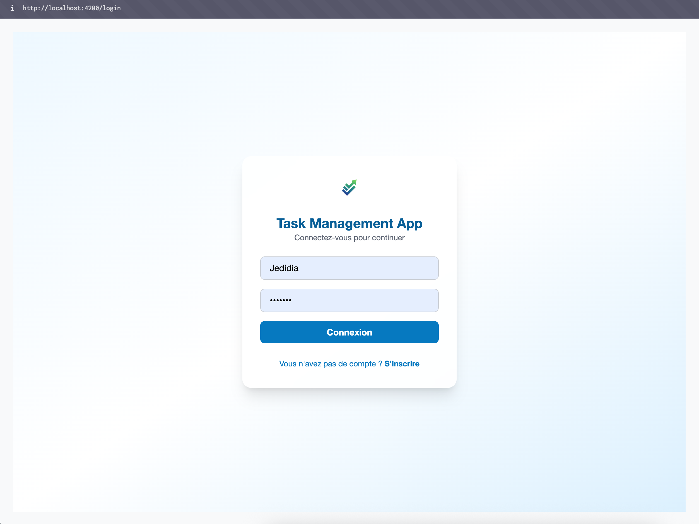
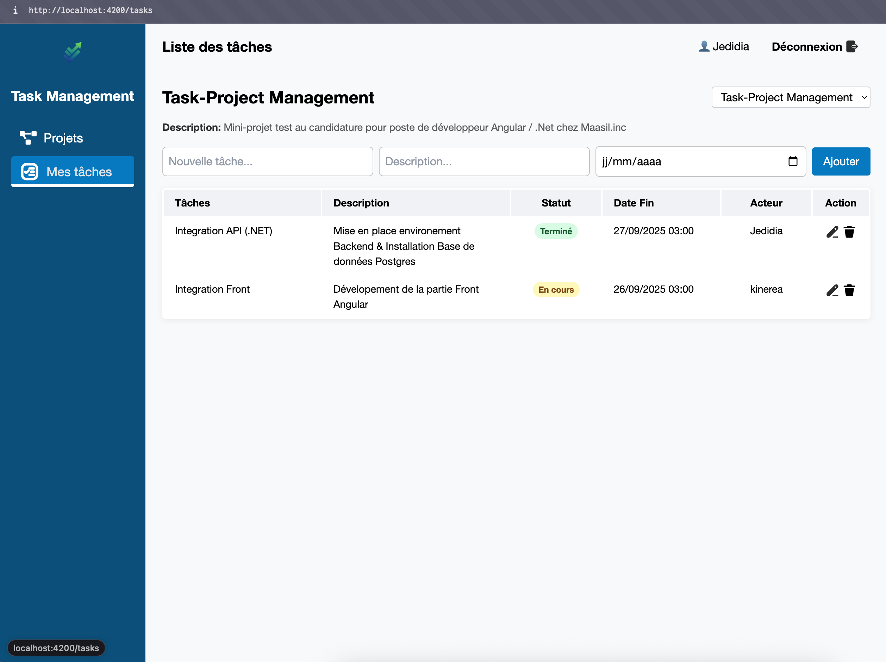

# Task Management App

## Description

Task Management App est une application web complète pour la gestion de projets et de tâches, développée dans un environnement moderne et professionnel. Elle permet de créer, modifier et suivre des projets et tâches, tout en assurant la sécurité, la performance et la maintenabilité du code.  

Cette application est un projet de démonstration qui illustre les bonnes pratiques de développement et l’utilisation de technologies modernes pour un environnement full-stack.

## Technologies Utilisées

- **Frontend :** Angular 20.3.2, TypeScript, TailwindCSS pour le style moderne et responsive  
- **Backend :** .NET 8.0.14, Entity Framework Core pour la gestion de la base de données  
- **Base de données :** PostgreSQL 14  
- **API & Authentification :** JWT (JSON Web Token) pour sécuriser les endpoints  
- **Conteneurisation :** Docker et Docker Compose pour un environnement isolé et reproductible  

## Architecture & Points Forts

### 1. Architecture moderne

- **Frontend** Angular séparé du **backend** .NET (API RESTful)  
- **Backend** structuré en modules et services
- **Docker Compose** pour orchestrer l’ensemble Front + Backend + Database  

### 2. Bonnes pratiques de développement

- **SOLID Principles** : code maintenable et évolutif  
- **Clean Code** : lisible, compréhensible et testable  
- **Modularité** : chaque composant et service Angular est indépendant et réutilisable  
- **Signal + RxJS** pour gestion moderne et réactive des états  

### 3. Sécurité

- **JWT Authentication** pour sécuriser les endpoints et protéger les données utilisateurs  
- Les mots de passe utilisateurs sont **hachés** et ne sont jamais stockés en clair

### 4. Fonctionnalités Clés

- Systeme d'Authentification
- Gestion complète des **projets et tâches**  
- Visualisation des tâches avec badge  
- Formulaires dynamiques pour la création et la modification de tâches  
- Architecture prête pour ajouter facilement de nouvelles fonctionnalités

### 5. Conteneurisation et déploiement

- Frontend Angular servi par **Nginx**  
- Backend .NET exposé via API RESTful  
- Base de données PostgreSQL avec création automatique via Docker volume  
- Prêt pour **plug & play** sur n’importe quelle machine avec Docker et Docker Compose

---

## Installation et Lancement

### Prérequis

- Docker & Docker Compose installés
- Git

### Étapes

1. Cloner le projet :

```bash
git clone https://github.com/Jedidiaamy-2427/PROJECT_TASK_MANAGEMENT.git

cd PROJECT_TASK_MANAGEMENT
```

2. Lancer les containers Docker :

```bash
docker compose up --build
```

3. Accéder à l’application :

.Frontend Angular: <http://localhost:4200>
.Backend API .NET: <http://localhost:8080/api/...>
.PostgreSQL sera créé automatiquement avec les tables nécessaires via EF Core Migrations.

## API Documentation

La documentation de l'API est générée automatiquement et disponible via Swagger. Pour y accéder, démarrez l'application et ouvrez votre navigateur :

```bash
http://localhost:8080/swagger/index.html
```

## Aperçu de l'application

1. Voici un aperçu de l'interface Login de Task Management App :



Le projet possède une interface d'authentification 


2. Voici un aperçu de l’interface de Task Management App :



Le projet possède une sidebar dynamique, un navbar moderne et des badges pour les tâches en retard.
